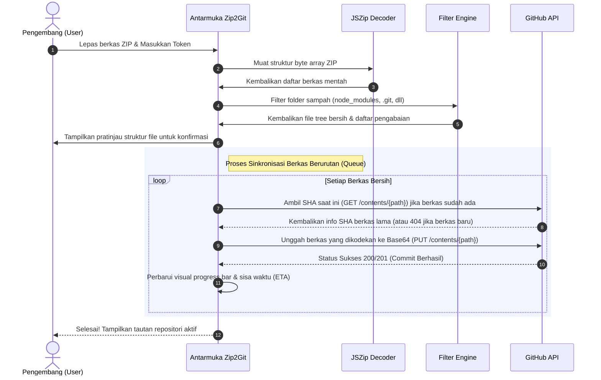

# Zip2Git 📦 ➡️ 🐙

**Zip2Git** adalah aplikasi web modern, ringan, dan 100% sisi klien (client-side) yang dirancang untuk membantu pengembang memigrasikan berkas arsip ZIP berisi kode sumber langsung menjadi repositori GitHub aktif secara instan tanpa perlu menginstal Git, Node, atau dependencies lokal di komputer Anda.

Dengan mengadopsi arsitektur **Single-Page Application (SPA)** murni, Zip2Git menjamin keamanan tingkat tinggi karena token akses GitHub dan berkas kode Anda diproses seluruhnya secara lokal di dalam peramban (browser) Anda.

---

## 🗺️ Skema Layout Antarmuka (Aesthetic UI Structure)

Berikut adalah visualisasi arsitektur navigasi mandiri, teratur, dan profesional dari antarmuka dasbor **Zip2Git**:

```text
┌────────────────────────────────────────────────────────────────────────┐
│  Zip2Git 📦                                  [ Sesi Aktif ]  [⚙️] [🌗]  │
├────────────────────────────────────────────────────────────────────────┤
│                                                                        │
│  [ Home ]  ➔  [ Login PAT ]  ➔  [ Dasbor Utama ]  ➔  [ Detail Sesi ]   │
│                                                                        │
│  ┌──────────────────────────────────────────────────────────────────┐  │
│  │   📤 AREA SERET & LEPAS (DRAG-AND-DROP ZIP FILE)                 │  │
│  │                                                                  │  │
│  │   "Letakkan berkas .zip Anda di sini untuk memulai ekstraksi"    │  │
│  └──────────────────────────────────────────────────────────────────┘  │
│                                                                        │
│  ┌─────────────────────────┐  ┌─────────────────────────────────────┐  │
│  │  ⚙️ Pengaturan Repositori │  │  🗂️ Pratinjau Struktur Berkas       │  │
│  │  • Pilih repo yang ada  │  │  📄 src/index.ts            [V]     │  │
│  │  • Buat repo baru       │  │  📄 package.json            [V]     │  │
│  │  • Set Default Branch   │  │  🚫 node_modules/        (Ignore)   │  │
│  └─────────────────────────┘  └─────────────────────────────────────┘  │
│                                                                        │
│  ┌──────────────────────────────────────────────────────────────────┐  │
│  │   🔄 BILAH KEMAJUAN UNGHAH (PROGRESS BAR)                        │  │
│  │   ─────────────────────────────────── 74% [================- ]   │  │
│  │   Mengunggah: src/components/HistoryList.tsx (23/45 berkas)      │  │
│  └──────────────────────────────────────────────────────────────────┘  │
└────────────────────────────────────────────────────────────────────────┘
```

---

## 🧬 Arsitektur Sistem (Architecture Diagram)

Arsitektur Zip2Git beroperasi sepenuhnya di sisi klien untuk memastikan perlindungan privasi yang maksimal tanpa adanya server perantara (serverless client processing).

```mermaid
graph TD
    %% Define Nodes
    LocalZIP[Arsip ZIP Lokal] -->|Drag & Drop| JSZip[JSZip Engine]
    PAT[Personal Access Token] -->|Input Manual| SessionStore[(Session Storage)]
    
    subgraph Browser Sandbox (Keamanan Klien 100%)
        JSZip -->|Ekstraksi & Rekursi| MemCache[Memory Buffer File Tree]
        MemCache -->|Filter Berkas Cerdas| FilterEngine[Engine Eliminasi Sampah]
        SessionStore -->|Otentikasi Aman| APICall[GitHub Contents Client]
    end

    FilterEngine -->|Berkas Bersih| APICall
    APICall -->|Koneksi HTTPS Langsung| GitHubAPI{{"api.github.com"}}

    subgraph Infrastruktur GitHub Cloud
        GitHubAPI -->|Cek Duplikasi SHA| GitCompare[SHA Validator]
        GitCompare -->|Tulis Berkas Baru/Update| GitCommit[Commit & Push]
        GitCommit -->|Hasil Akhir| GitRepo[(Repositori Target)]
    end

    classDef browser fill:#f9f5ff,stroke:#6366f1,stroke-width:2px;
    classDef github fill:#f0fdf4,stroke:#16a34a,stroke-width:2px;
    class JSZip,MemCache,FilterEngine,APICall browser;
    class GitHubAPI,GitCompare,GitCommit,GitRepo github;
```

---

## 🔄 Alur Kerja Ekstraksi & Sinkronisasi (Upload Flow Diagram)

Proses pemisahan, penyaringan (filtering), pembandingan SHA, dan pengunggahan rekursif berjalan secara asinkron tanpa *thread blocking*:



---

## ✨ Fitur Utama

- **Otentikasi Aman via PAT (Personal Access Token):** Masuk langsung secara instan. Token Anda disimpan secara lokal di `sessionStorage` peramban Anda dan akan otomatis hancur begitu tab atau browser ditutup.
- **Dekompresi Sisi Klien:** Berkas ZIP Anda diekstrak langsung di dalam peramban menggunakan mesin **JSZip**, menjaga kerahasiaan berkas proyek tanpa mengirimkannya ke server perantara mana pun.
- **Pengabaian Berkas Cerdas (Smart Ignorance):** Secara otomatis mendeteksi dan mengabaikan berkas sampah atau folder dependensi besar, seperti:
  - `node_modules/`
  - `.git/` / `.github/`
  - `.DS_Store`
  - `Thumbs.db`
  - `dist/` / `build/`
- **Manajemen Repositori:**
  - Pilih repositori yang sudah ada dari akun GitHub Anda secara dinamis.
  - Buat repositori baru (Publik atau Privat) langsung dari aplikasi, lengkap dengan opsi inisialisasi berkas `README.md`.
- **Unggah Rekursif & Cerdas:** Mengunggah seluruh struktur folder secara otomatis. Dilengkapi pendeteksi SHA git otomatis untuk menghindari kesalahan bentrok (*conflict 422*) saat menulis di atas berkas yang sudah ada.
- **Indikator Kemajuan Real-time:** Menampilkan persentase unggahan, nama berkas aktif, jumlah berkas tersisa, dan kalkulasi estimasi waktu selesai (ETA) yang presisi.
- **Pintasan Keyboard Terintegrasi:** Navigasi cepat ala GitHub menggunakan keyboard Anda.
- **Mode Gelap Tepercaya:** Dilengkapi mode gelap visual secara bawaan dan mode terang opsional yang responsif.

---

## 🛠️ Stack Teknologi

- **Frontend:** React 19, TypeScript, Vite, Tailwind CSS, React Router v7, Lucide Icons, Motion (Framer Motion)
- **Utility:** JSZip (ZIP decompression), React Hot Toast (Notifikasi)
- **Deployment-Ready:** Vercel / Cloud Run / Static App Servers

---

## ⌨️ Pintasan Keyboard

Gunakan tombol keyboard berikut untuk navigasi cepat di aplikasi Zip2Git:

- `g` lalu `h` — Navigasi ke **Beranda (Home)**
- `g` lalu `d` — Navigasi ke **Dasbor (Dashboard)**
- `g` lalu `a` — Navigasi ke **Sesi Aktif (Active Session)**
- `g` lalu `i` — Navigasi ke **Tentang (About)**
- `g` lalu `s` — Navigasi ke **Pengaturan (Settings)**
- `g` lalu `l` — Keluar Sesi / Masuk
- `t` — Alihkan Tema (Gelap ⇋ Terang)
- `?` — Tampilkan / Tutup Panduan Pintasan

---

## 🚀 Memulai (Panduan Penggunaan Lokal)

### Prasyarat
Pastikan Anda telah menginstal **Node.js** (versi 18 ke atas) di komputer Anda.

### 1. Instal Dependensi
Jalankan perintah berikut pada direktori root proyek untuk memasang seluruh paket dependensi:
```bash
npm install
```

### 2. Jalankan Mode Pengembangan
Booting dev-server lokal Vite pada port 3000 dengan perintah:
```bash
npm run dev
```
Buka peramban Anda di alamat [http://localhost:3000](http://localhost:3000).

### 3. Build Proyek untuk Produksi
Gunakan perintah berikut untuk mengompilasi berkas statis siap sebar (deploy-ready) di dalam folder `dist/`:
```bash
npm run build
```

---

## 🔑 Cara Membuat Personal Access Token (PAT) di GitHub

Untuk mengizinkan Zip2Git berinteraksi dengan akun GitHub Anda:

1. Buka [Halaman Pengaturan Token GitHub](https://github.com/settings/tokens).
2. Klik tombol **Generate new token** dan pilih **Generate new token (classic)**.
3. Berikan nama catatan (misal: `Zip2Git Web Client`).
4. Pada bagian **Select Scopes**, centang opsi:
   - **`repo`** (Wajib - Mengontrol akses penuh ke repositori privat dan publik).
5. Gulir ke bawah, klik **Generate token**, lalu salin string token tersebut.
6. Masukkan token tersebut pada halaman `/login` di aplikasi Zip2Git Anda.

---

## 🔒 Keamanan & Privasi Tingkat Tinggi

Aplikasi ini **100% aman**:
- Token akses GitHub Anda hanya disimpan di memori temporer peramban (`sessionStorage`) dan tidak pernah dikirimkan ke server kami.
- Dekompresi arsip ZIP dilakukan sepenuhnya secara lokal. Kode Anda langsung dikirimkan langsung dari peramban Anda ke API resmi GitHub (`api.github.com`).
- Tidak ada telemetry tracker, iklan, cookie pihak ketiga, atau logging data apa pun.
